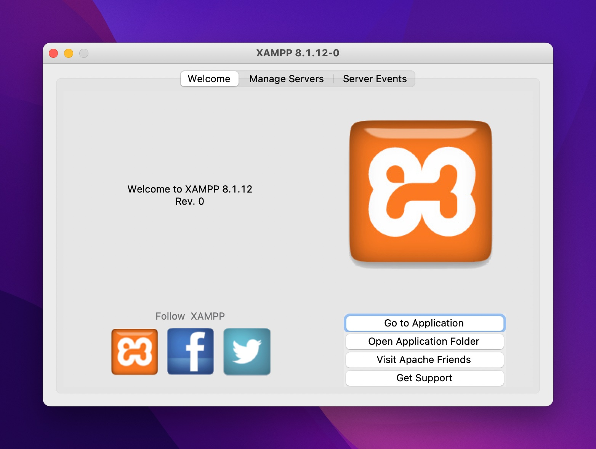
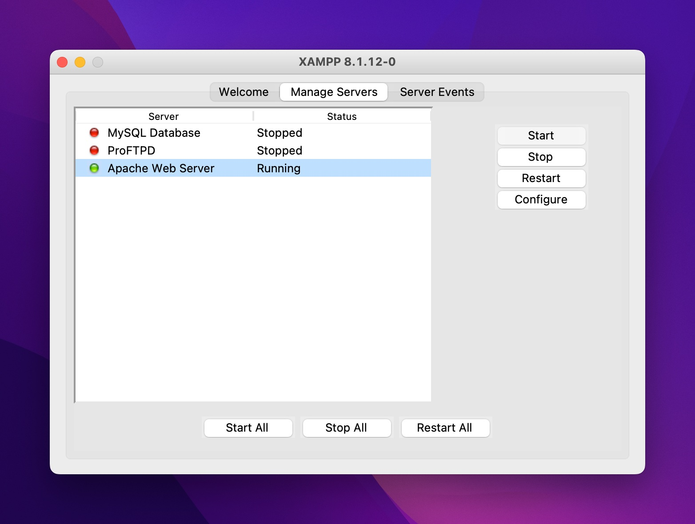

# PHP Basics 💻<!-- omit in toc -->

> In this project we learnt the basic notions of PHP which is widely used in the world of web development.
>
> What distinguishes PHP from other languages ​​such as Javascript is that the code is executed on the server, generating HTML and sending it to the client.

## Index <!-- omit in toc -->

- [Requirements](#requirements)
- [Technologies used](#technologies-used)
- [Resources](#resources)

## Requirements

- Learn the basics to program in PHP
- Installing and using XAMPP
- Navigate to htdocs and create all files to appear on localserver
- Understand what a server-side language is and what it is used for

## Screen Captures of Xampp

<h2>Welcome Page XAMPP</h2>

<h2>XAMPP Apache</h2>

## Technologies used

\* PHP
\* Xampp 
\* VSCode

## Resources

- [XAMPP](https://www.apachefriends.org/es/index.html)

