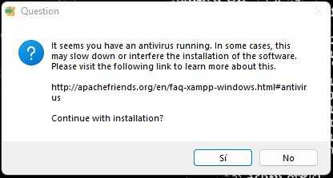
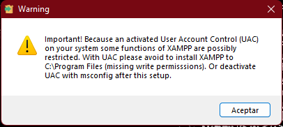
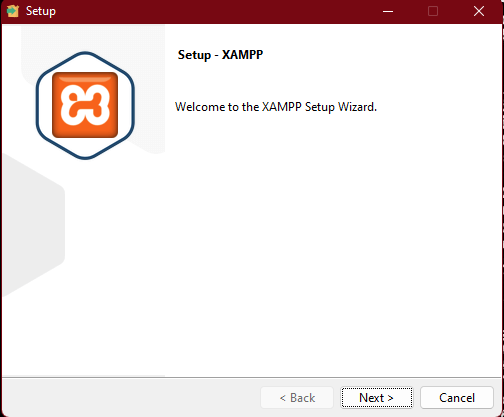
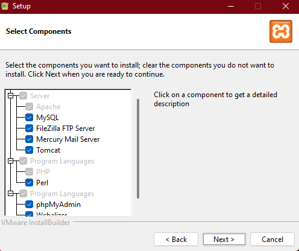
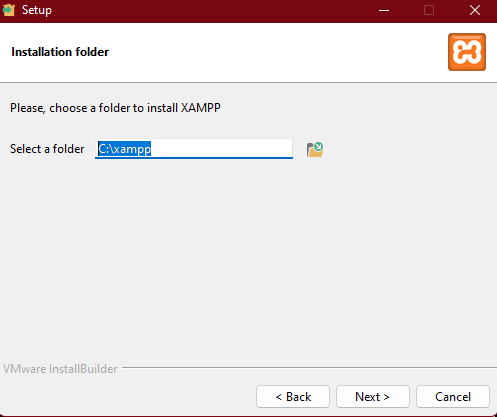
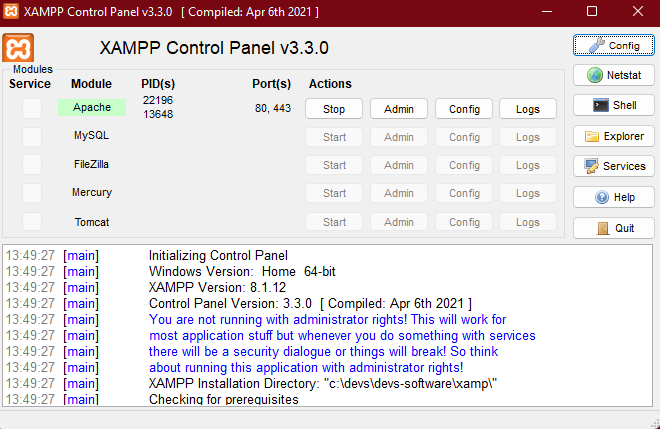

# Project Title

PHP Basics

## Getting Started

To start this project you only have to run Apache server and open it in your browser with one of the pages that this project include. I recommend that you install XAMPP

## Prerequisites

Install XAMPP in your computer and run Apache server.

## Installing XAMPP
<ul>
  <li>You can download XAMPP in this page https://www.apachefriends.org/es/download.html</li>
  <li>Choose your SO and architecture and download it.</li>
</ul>

Click Yes.

Click Accept.

Click Next.

Select the optional content that you want. You can notice that Apache server is default selected.

And finally, select the path where you want to install it.

## Running Apache Server

Once you have installed XAMPP, open it and run Apache.

Give an example
And coding style tests
Explain what these tests test and why

Give an example
Deployment
Add additional notes about how to deploy this on a live system

Built With
Dropwizard - The web framework used
Maven - Dependency Management
ROME - Used to generate RSS Feeds
Contributing
Please read CONTRIBUTING.md for details on our code of conduct, and the process for submitting pull requests to us.

Versioning
We use SemVer for versioning. For the versions available, see the tags on this repository.

Authors
Billie Thompson - Initial work - PurpleBooth
See also the list of contributors who participated in this project.

License
This project is licensed under the MIT License - see the LICENSE.md file for details

Acknowledgments
Hat tip to anyone whose code was used
Inspiration
etc
