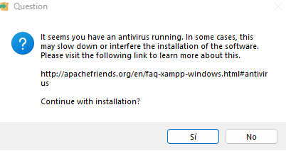
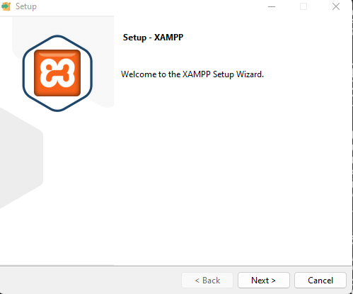
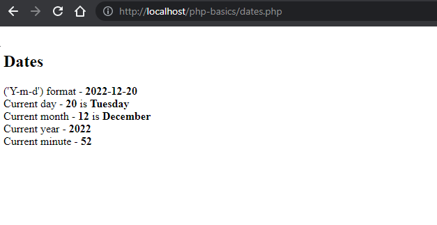

# Project Title

PHP Basics

## Getting Started

To start this project you only have to run Apache server and open it in your browser with one of the pages that this project include. I recommend that you install XAMPP

## Prerequisites

Install XAMPP in your computer and run Apache server.

## Installing XAMPP
<ul>
  <li>You can download XAMPP in this page https://www.apachefriends.org/es/download.html</li>
  <li>Choose your SO and architecture and download it.</li>

<li>Click Yes.</li>

<li>Click Accept.</li>

<li>Click Next.</li>

<li>Select the optional content that you want. You can notice that Apache server is default selected.</li>

<li>And finally, select the path where you want to install it.</li>
</ul>
## Running Apache Server

Once you have installed XAMPP, open it and run Apache until it appears in green and with PID port numbers.

## How can you open a Page?

You just write "localhost/php-basics/{page name}.php" and you could view this page content.

## Built With
<ul>
  <li>PHP</li>
  <li>Visual Studio Code</li>
</ul>

## Author
Antonio Rufino Casasus - Assembler Institute of Technology

## License
This project is licensed under the MIT License.
